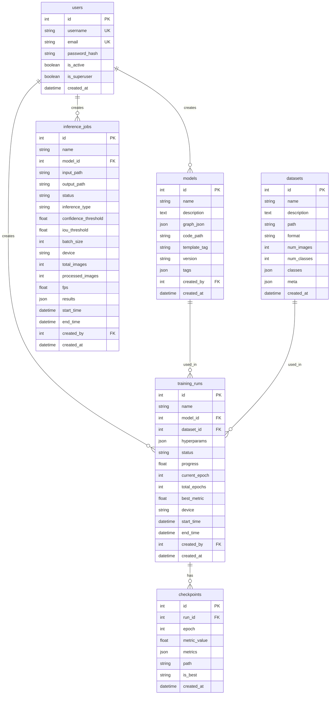

# CV Studio 数据库设计文档

> 更新日期：2025-12-16
> 数据库类型：SQLite
> ORM框架：SQLAlchemy

---

## 📋 概述

CV Studio使用SQLite作为主要数据库，通过SQLAlchemy ORM进行数据访问。数据库设计遵循关系型数据库范式，支持用户管理、数据集管理、模型构建、训练任务和推理功能。

---

## 🗄️ 数据库表结构

### 1. users（用户表）

用户认证和权限管理。

| 字段名 | 类型 | 约束 | 说明 |
|--------|------|------|------|
| id | INTEGER | PRIMARY KEY, AUTO INCREMENT | 用户唯一标识 |
| username | VARCHAR(50) | UNIQUE, NOT NULL, INDEX | 用户名 |
| email | VARCHAR(100) | UNIQUE, NOT NULL, INDEX | 邮箱地址 |
| password_hash | VARCHAR(255) | NOT NULL | 密码哈希值 |
| is_active | BOOLEAN | DEFAULT TRUE | 账户状态 |
| is_superuser | BOOLEAN | DEFAULT FALSE | 是否为超级用户 |
| created_at | DATETIME | DEFAULT CURRENT_TIMESTAMP | 创建时间 |

**关联关系**：
- 一对多关联到 `models`（创建的模型）
- 一对多关联到 `training_runs`（创建的训练任务）
- 一对多关联到 `inference_jobs`（创建的推理任务）

### 2. datasets（数据集表）

存储数据集的元信息。

| 字段名 | 类型 | 约束 | 说明 |
|--------|------|------|------|
| id | INTEGER | PRIMARY KEY, AUTO INCREMENT | 数据集唯一标识 |
| name | VARCHAR(100) | NOT NULL, INDEX | 数据集名称 |
| description | TEXT | NULL | 数据集描述 |
| path | VARCHAR(500) | NOT NULL | 数据集存储路径 |
| format | VARCHAR(20) | NOT NULL | 数据格式（yolo/coco/voc/classification） |
| num_images | INTEGER | DEFAULT 0 | 图像数量 |
| num_classes | INTEGER | DEFAULT 0 | 类别数量 |
| classes | JSON | NULL | 类别信息 |
| meta | JSON | NULL | 元数据（图像尺寸、统计信息等） |
| is_active | VARCHAR(10) | DEFAULT 'active' | 状态（active/deleted） |
| created_at | DATETIME | DEFAULT CURRENT_TIMESTAMP | 创建时间 |
| updated_at | DATETIME | ON UPDATE CURRENT_TIMESTAMP | 更新时间 |

**关联关系**：
- 一对多关联到 `training_runs`（使用此数据集的训练）

### 3. models（模型表）

存储用户构建的神经网络模型。

| 字段名 | 类型 | 约束 | 说明 |
|--------|------|------|------|
| id | INTEGER | PRIMARY KEY, AUTO INCREMENT | 模型唯一标识 |
| name | VARCHAR(100) | NOT NULL, INDEX | 模型名称 |
| description | TEXT | NULL | 模型描述 |
| graph_json | JSON | NOT NULL | 模型图的JSON表示 |
| code_path | VARCHAR(500) | NULL | 生成的PyTorch代码路径 |
| template_tag | VARCHAR(50) | NULL | 模板标签 |
| version | VARCHAR(20) | DEFAULT '1.0' | 版本号 |
| tags | JSON | NULL | 标签信息 |
| is_active | VARCHAR(10) | DEFAULT 'active' | 状态（active/deleted） |
| created_by | INTEGER | FOREIGN KEY(users.id) | 创建者ID |
| created_at | DATETIME | DEFAULT CURRENT_TIMESTAMP | 创建时间 |
| updated_at | DATETIME | ON UPDATE CURRENT_TIMESTAMP | 更新时间 |

**关联关系**：
- 多对一关联到 `users`（创建者）
- 一对多关联到 `training_runs`（使用此模型的训练）

### 4. training_runs（训练任务表）

管理模型训练任务。

| 字段名 | 类型 | 约束 | 说明 |
|--------|------|------|------|
| id | INTEGER | PRIMARY KEY, AUTO INCREMENT | 训练任务唯一标识 |
| name | VARCHAR(100) | NOT NULL, INDEX | 任务名称 |
| description | TEXT | NULL | 任务描述 |
| model_id | INTEGER | FOREIGN KEY(models.id), NOT NULL | 使用的模型ID |
| dataset_id | INTEGER | FOREIGN KEY(datasets.id), NOT NULL | 使用的数据集ID |
| hyperparams | JSON | NULL | 超参数配置 |
| status | VARCHAR(20) | DEFAULT 'pending' | 任务状态（pending/running/completed/failed/stopped） |
| progress | FLOAT | DEFAULT 0.0 | 进度百分比（0-100） |
| current_epoch | INTEGER | DEFAULT 0 | 当前轮次 |
| total_epochs | INTEGER | DEFAULT 0 | 总轮次数 |
| best_metric | FLOAT | NULL | 最佳指标值 |
| device | VARCHAR(20) | DEFAULT 'cpu' | 训练设备（cpu/cuda） |
| log_file | VARCHAR(500) | NULL | 日志文件路径 |
| error_message | TEXT | NULL | 错误信息 |
| start_time | DATETIME | NULL | 开始时间 |
| end_time | DATETIME | NULL | 结束时间 |
| created_by | INTEGER | FOREIGN KEY(users.id) | 创建者ID |
| created_at | DATETIME | DEFAULT CURRENT_TIMESTAMP | 创建时间 |
| updated_at | DATETIME | ON UPDATE CURRENT_TIMESTAMP | 更新时间 |

**关联关系**：
- 多对一关联到 `models`（使用的模型）
- 多对一关联到 `datasets`（使用的数据集）
- 多对一关联到 `users`（创建者）
- 一对多关联到 `checkpoints`（检查点）

### 5. checkpoints（检查点表）

存储训练过程中的模型检查点。

| 字段名 | 类型 | 约束 | 说明 |
|--------|------|------|------|
| id | INTEGER | PRIMARY KEY, AUTO INCREMENT | 检查点唯一标识 |
| run_id | INTEGER | FOREIGN KEY(training_runs.id), NOT NULL | 训练任务ID |
| epoch | INTEGER | NOT NULL | 训练轮次 |
| metric_value | FLOAT | NULL | 主要指标值 |
| metrics | JSON | NULL | 所有指标详情 |
| path | VARCHAR(500) | NOT NULL | 检查点文件路径 |
| file_size | INTEGER | NULL | 文件大小（字节） |
| is_best | VARCHAR(10) | DEFAULT 'false' | 是否为最佳模型 |
| created_at | DATETIME | DEFAULT CURRENT_TIMESTAMP | 创建时间 |

**关联关系**：
- 多对一关联到 `training_runs`（所属训练任务）

### 6. inference_jobs（推理任务表）

管理模型推理任务。

| 字段名 | 类型 | 约束 | 说明 |
|--------|------|------|------|
| id | INTEGER | PRIMARY KEY, AUTO INCREMENT | 推理任务唯一标识 |
| name | VARCHAR(100) | NOT NULL, INDEX | 任务名称 |
| model_id | INTEGER | FOREIGN KEY(models.id), NOT NULL | 使用的模型ID |
| input_path | VARCHAR(500) | NOT NULL | 输入文件/文件夹路径 |
| output_path | VARCHAR(500) | NULL | 输出路径 |
| status | VARCHAR(20) | DEFAULT 'pending' | 任务状态（pending/running/completed/failed） |
| inference_type | VARCHAR(20) | DEFAULT 'single' | 推理类型（single/batch） |
| confidence_threshold | FLOAT | DEFAULT 0.5 | 置信度阈值 |
| iou_threshold | FLOAT | DEFAULT 0.45 | IoU阈值 |
| batch_size | INTEGER | DEFAULT 1 | 批处理大小 |
| device | VARCHAR(20) | DEFAULT 'cpu' | 推理设备 |
| total_images | INTEGER | DEFAULT 0 | 总图像数量 |
| processed_images | INTEGER | DEFAULT 0 | 已处理图像数量 |
| fps | FLOAT | NULL | 推理速度 |
| error_message | TEXT | NULL | 错误信息 |
| results | JSON | NULL | 推理结果摘要 |
| start_time | DATETIME | NULL | 开始时间 |
| end_time | DATETIME | NULL | 结束时间 |
| created_by | INTEGER | FOREIGN KEY(users.id) | 创建者ID |
| created_at | DATETIME | DEFAULT CURRENT_TIMESTAMP | 创建时间 |
| updated_at | DATETIME | ON UPDATE CURRENT_TIMESTAMP | 更新时间 |

**关联关系**：
- 多对一关联到 `models`（使用的模型）
- 多对一关联到 `users`（创建者）

---

## 🔄 关系图



---

## 📊 索引策略

### 主要索引

1. **users表**
   - `username` - 唯一索引（登录查询）
   - `email` - 唯一索引（邮箱查询）

2. **models表**
   - `name` - 普通索引（模型搜索）
   - `created_by` - 外键索引

3. **datasets表**
   - `name` - 普通索引（数据集搜索）
   - `format` - 普通索引（格式筛选）

4. **training_runs表**
   - `name` - 普通索引（任务搜索）
   - `model_id` - 外键索引
   - `dataset_id` - 外键索引
   - `status` - 普通索引（状态筛选）

5. **inference_jobs表**
   - `name` - 普通索引（任务搜索）
   - `model_id` - 外键索引

---

## 🔧 数据库操作

### 初始化数据库

```bash
# 进入后端目录
cd backend

# 初始化数据库（创建表和默认用户）
python init_db.py --init

# 重置数据库（删除所有数据重新创建）
python init_db.py --reset
```

### 默认用户

系统初始化时会创建以下默认用户：

| 用户名 | 密码 | 邮箱 | 角色 |
|--------|------|------|------|
| admin | admin123 | admin@cvstudio.com | 超级管理员 |
| demo | demo123 | demo@cvstudio.com | 普通用户 |

---

## 📈 性能优化

### 1. 查询优化
- 为常用查询字段添加索引
- 使用外键约束确保数据一致性
- 合理使用分页查询

### 2. 存储优化
- JSON字段用于存储灵活的配置和元数据
- 大文件路径存储而非文件本身
- 定期清理软删除的数据

### 3. 并发控制
- SQLite的写操作需要适当的锁机制
- 长时间运行的任务（训练）使用异步处理

---

## 🚀 扩展性考虑

### 1. 数据库迁移
- 使用Alembic进行数据库版本管理
- 支持向后兼容的架构变更

### 2. 数据备份
- 定期备份SQLite数据库文件
- 重要模型和数据集的冗余存储

### 3. 监控和日志
- 记录数据库操作日志
- 监控查询性能

---

**文档版本**: v1.0
**最后更新**: 2025-12-16